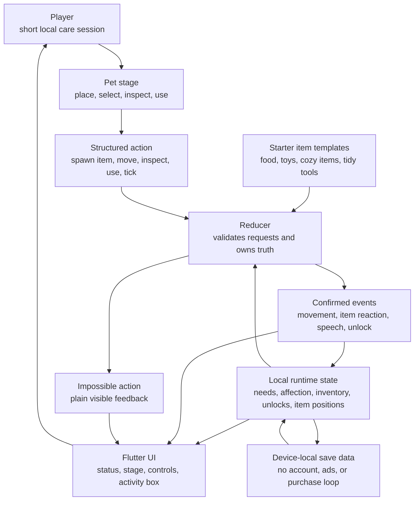

# Chatty-Pet

Chatty-Pet is a Flutter app for a small reducer-owned pet terrarium. The current build is a local-first care toy where Chatty can notice items, move around the stage, and react through reducer-confirmed outcomes.

This repository is the public source release for Chatty-Pet. The same shared Flutter codebase covers the app logic and the supported platform wrappers in this repo, including Android, Windows, and web.

## Install

- Google Play: <https://play.google.com/store/apps/details?id=io.instance001.chattypet>
- Direct APK: <https://github.com/instance001/chatty-pet/releases/download/v1.0.0-b1/chatty-pet-v1.0.0-b1.apk>
- Latest releases: <https://github.com/instance001/chatty-pet/releases>
- Obtainium guide: <https://instance001.github.io/obtainium.html>

The direct APK is provided for users who prefer GitHub release installs or Obtainium updates. Google Play remains the easiest install path for most Android users.

## Screenshots


| Care views | Support views |
| --- | --- |
|  |  |
|  |  |

## Public Links

- Google Play: <https://play.google.com/store/apps/details?id=io.instance001.chattypet>
- Direct APK release: <https://github.com/instance001/chatty-pet/releases/tag/v1.0.0-b1>
- Privacy policy: <https://instance001.github.io/privacy/chatty-pet.html>
- FMI Google Play directory: <https://instance001.github.io/google-play.html>
- Publisher site: <https://instance001.github.io/>

## What It Is

Chatty-Pet is built as a tiny, readable care loop:

- place items on the stage
- guide Chatty toward interesting objects
- inspect or use selected items
- help Chatty stay fed, rested, tidy, playful, and cheerful

The app is designed to stay honest about what it is:

- local-first play
- no account required
- no ads
- no in-app purchases
- save data stays on the device

## Design Spine

The app follows a simple deterministic doctrine:

- reducer owns truth
- UI renders truth
- templates define possibility
- events describe confirmed outcomes
- support surfaces explain the toy instead of expecting players to guess

RD Engine doctrine is the architectural spine behind Chatty-Pet's reducer-governed world state, even though this app is implemented here as a Flutter project rather than as a Rust desktop app.

## Care Loop Map



## Current Status

The current public source release includes:

- deterministic pet loop implementation
- splash, stage, controls, and item strip
- in-app `Help`, `Privacy`, and `About` support surfaces
- local save/load behavior
- Android release bundle generation
- automated analysis and test coverage for core reducer behavior

## Storage And Release Layout

Chatty-Pet stores gameplay progress through Flutter's platform-managed `shared_preferences` storage. It does not write saves into repository-relative folders or require a portable data directory beside the executable.

Android signing secrets stay local: `android/key.properties` and keystore files are ignored, while `android/key.properties.example` documents the expected shape. Build outputs under `build/` and Android generated release folders are ignored.

## Development

```powershell
flutter pub get
flutter analyze
flutter test
flutter run -d windows
flutter build apk --release
flutter build appbundle --release
```

## Project Layout

```text
chatty-pet/
  lib/        Flutter app and game logic
  assets/     Audio and branding assets used by the app
  android/    Android wrapper and release configuration
  windows/    Windows desktop wrapper
  web/        Web wrapper
  test/       Reducer and codec tests
  docs/       Product, release, privacy, and architecture notes
```

## Docs

- [docs/ARCHITECTURE.md](docs/ARCHITECTURE.md)
- [docs/REDUCER_SPEC.md](docs/REDUCER_SPEC.md)
- [docs/DATAPACK_SPEC.md](docs/DATAPACK_SPEC.md)
- [docs/ROADMAP.md](docs/ROADMAP.md)
- [docs/V0_1_ACCEPTANCE.md](docs/V0_1_ACCEPTANCE.md)
- [docs/APP_IDENTITY.md](docs/APP_IDENTITY.md)
- [docs/ANDROID_RELEASE_SIGNING.md](docs/ANDROID_RELEASE_SIGNING.md)
- [docs/RELEASE_READINESS.md](docs/RELEASE_READINESS.md)
- [docs/PLAY_STORE_METADATA.md](docs/PLAY_STORE_METADATA.md)
- [docs/PRIVACY_POLICY.md](docs/PRIVACY_POLICY.md)
- [GLOSSARY.md](GLOSSARY.md)

## License

Chatty-Pet is released under the GNU Affero General Public License v3.0 or later.

See [LICENSE](LICENSE).
